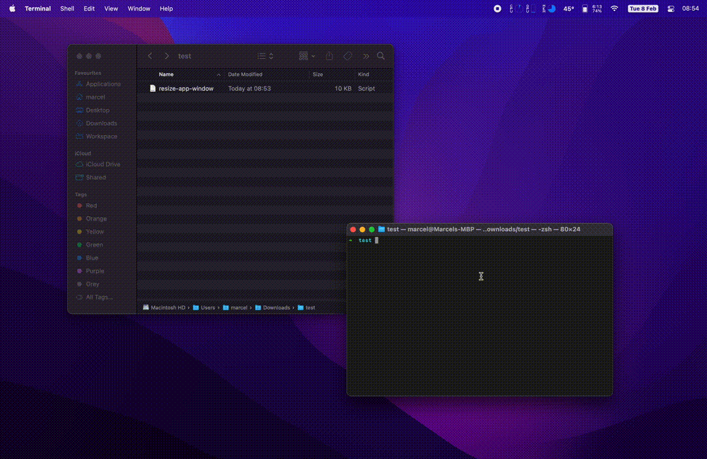

Resizing a MacOS app window to 16:9 using AppleScript from the command line.

During the last week, I needed to **resize a MacOS app window to a 16:9 aspect ratio** because I wanted to screen record on the same ratio of the video canvas of the edit I was working on.

I couldn't find much useful information about this topic online, but one nice [post from Ethan Banks](https://ethancbanks.com/using-applescript-to-size-a-window-to-16x9-on-macos/) on how to use AppleScript for the manner gave me what I needed to get started.

I had some extra needs like selecting the application I wanted to resize from a list of apps and making the window full size with a maximum width constraint, so I have decided to write this blog sharing my own implementation. Cheers to [@ecbanks](https://twitter.com/ecbanks) for the initial version! 😄

## How to size a MacOS window to 16:9

The requirements for this script are:
* Showing a **list of available windows** to manually select which one to resize.
* Resizing the selected ones to **16:9 aspect ratio using the maximum width available**.
* Setting up a **max-width** constraint to avoid too large windows.

This is the **AppleScript** code needed to do all of this:

```applescript
# Import needed libraries
use framework "Foundation"
use framework "AppKit"
use scripting additions

# Display selectable list of applications and save selection
tell application "System Events"
	set listOfProcesses to (name of every process where background only is false)
	tell me to set selectedApps to choose from list listOfProcesses with multiple selections allowed
end tell

# Get the available width and height of the primary screen (minus toolbar and dock)
set primaryDisplay to current application's NSScreen's screens()'s firstObject()'s visibleFrame()
set screenWidth to item 1 of item 2 of primaryDisplay as integer
set screenHeight to item 2 of item 2 of primaryDisplay as integer

# Ratio for our app window
set ratio to 16 / 9

# Max width we want our app to be
set maxWidth to 2048 as integer

# Calculate appWidth based on maxWidth constraint
set appWidth to screenWidth as integer
if appWidth > maxWidth then
	set appWidth to maxWidth as integer
end if

# Calculate new app height
set appHeight to appWidth / ratio as integer

# If the calculated height is bigger than screen height, set app height as screen height
# and calculate the appWidth accordingly
if appHeight > screenHeight then
	set appHeight to screenHeight as integer
	set appWidth to appHeight * ratio
end if

# Calculate app screen position (centered)
set xPos to (screenWidth - appWidth) / 2 as integer
set yPos to 0 as integer

# Loop through selected apps
repeat with selectedApp in selectedApps

	# Set app position and size to calculated values
	tell application "System Events" to tell process selectedApp

		tell window 1
			set position to {xPos, yPos}
			set size to {appWidth, appHeight}
		end tell
		get size of window 1
	end tell

end repeat
```

You can find the code on my GitHub repository following the link [GitHub repo - Resize MacOS window to 16:9](https://github.com/marcelpallares/resize-window-macos).

To run the code just download the `.scpt` files from GitHub or create your own scrips through **Script Editor** and run them from the **Terminal** with the command:

```shell
osascript resize-app-window-max-width.scpt
```

Finally, you will need to give Accessibility/Automation permissions to control your computer to the **Terminal/Script Editor** when running the script.

Happy coding!
