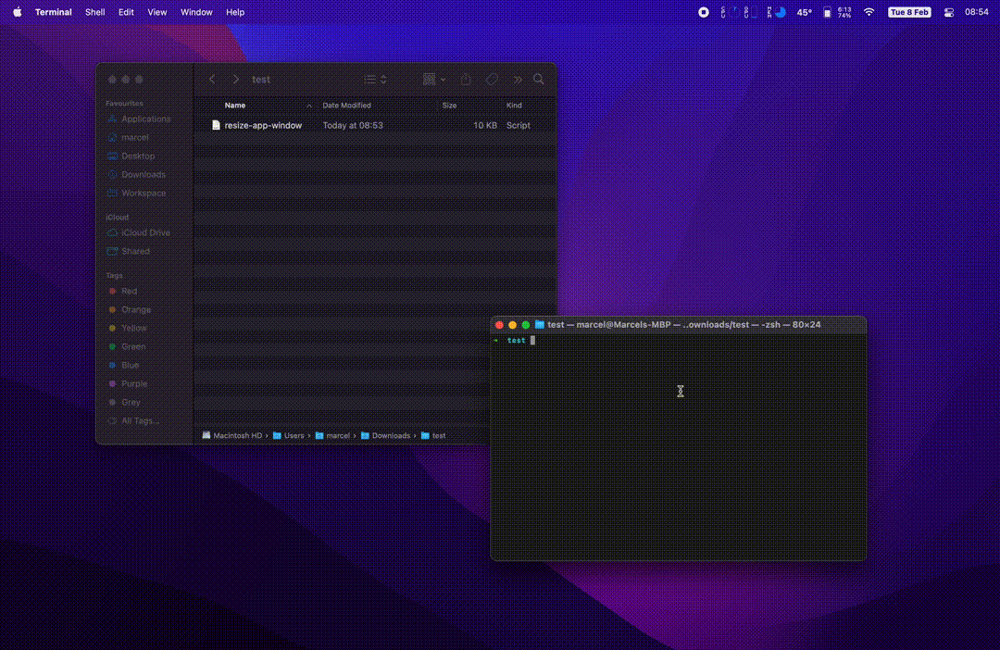

Cambiar el tamaño de una ventana de MacOS a 16:9 usando AppleScript desde la terminal.

Esta última semana necesité **modificar el tamaño de una ventana de MacOS a un aspect ratio de 16:9** ya que quería poder grabar dicha ventana usando el mismo ratio que el canvas de edición de un vídeo en el que estaba trabajando.

No pude encontrar demasiada información sobre el tema online, sin embargo, un [post de Ethan Banks](https://ethancbanks.com/using-applescript-to-size-a-window-to-16x9-on-macos/) sobre cómo hacer esto usando AppleScript me dió lo que necesitaba para empezar.

Tuve que realizar algunos ajustes en el código ya que quería poder seleccionar la aplicación a ajustar desde una lista de apps en vez de definirla manualmente en el script, y también necesitaba hacer que la ventana se ajustara a la máxima anchura posible y definir un tamaño máximo de esta.

Por ello he decidido compartir mi solución en este post. ¡Gracias a [@ecbanks](https://twitter.com/ecbanks) por la primera versión! 😄

## Cómo cambiar el tamaño de una ventana en MacOS a 16:9

Los requerimientos de este script són:
* Poder seleccionar la aplicación a ajustar desde una **lista de las ventanas disponibles**.
* Cambiar el tamaño de la ventana seleccionada a un **ratio 16:9 usando la anchura máxima disponible**.
* Poder configurar un **tamaño máximo** de anchura que tomará la ventana.

Este es el código en **AppleScript** que necesitamos para ello:

```applescript
# Import needed libraries
use framework "Foundation"
use framework "AppKit"
use scripting additions

# Display selectable list of applications and save selection
tell application "System Events"
	set listOfProcesses to (name of every process where background only is false)
	tell me to set selectedApps to choose from list listOfProcesses with multiple selections allowed
end tell

# Get the available width and height of the primary screen (minus toolbar and dock)
set primaryDisplay to current application's NSScreen's screens()'s firstObject()'s visibleFrame()
set screenWidth to item 1 of item 2 of primaryDisplay as integer
set screenHeight to item 2 of item 2 of primaryDisplay as integer

# Ratio for our app window
set ratio to 16 / 9

# Max width we want our app to be
set maxWidth to 2048 as integer

# Calculate appWidth based on maxWidth constraint
set appWidth to screenWidth as integer
if appWidth > maxWidth then
	set appWidth to maxWidth as integer
end if

# Calculate new app height
set appHeight to appWidth / ratio as integer

# If the calculated height is bigger than screen height, set app height as screen height
# and calculate the appWidth accordingly
if appHeight > screenHeight then
	set appHeight to screenHeight as integer
	set appWidth to appHeight * ratio
end if

# Calculate app screen position (centered)
set xPos to (screenWidth - appWidth) / 2 as integer
set yPos to 0 as integer

# Loop through selected apps
repeat with selectedApp in selectedApps

	# Set app position and size to calculated values
	tell application "System Events" to tell process selectedApp

		tell window 1
			set position to {xPos, yPos}
			set size to {appWidth, appHeight}
		end tell
		get size of window 1
	end tell

end repeat
```

Puedes encontrar el código en mi repositorio de **GitHub** siguiendo el link [GitHub repo - Resize MacOS window to 16:9](https://github.com/marcelpallares/resize-window-macos).

Para ejecutar el código primero deberás descargarte el archivo `.scpt` desde mi GitHub o crear tu propio script copiando el código de este post en la app **Script Editor** de MacOS.

Finalmente, ejecuta el script utilizando el siguiente comando en la **Terminal**:

```shell
osascript resize-app-window-max-width.scpt
```

Deberás dar permisos de Accesibilidad/Automatización para poder controlar tu ordenador a la **Terminal/Script Editor** cuando ejecutes el script.

Happy coding!
